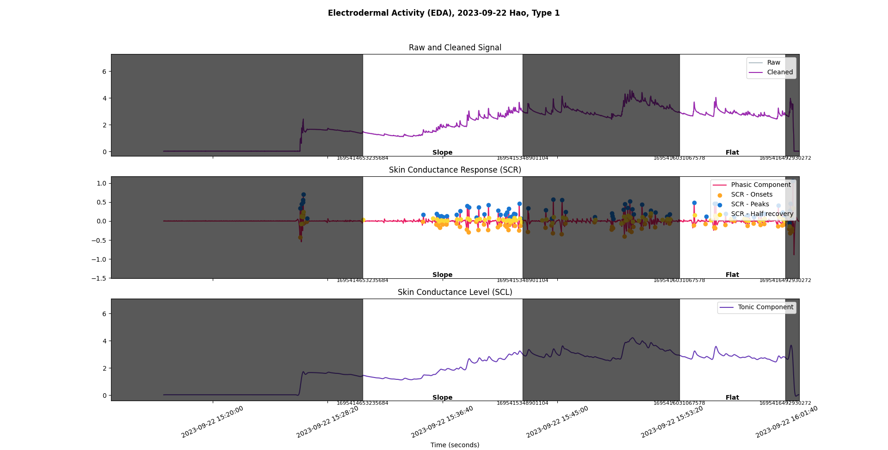

# split-eda

This package provides a script to visualize electrodermal activity data, using the analysis library [`neurokit2`](https://github.com/neuropsychology/NeuroKit).

# Examples



# Usage

First, clone this repository. Then install the required dependencies by running in the repository root:

```bash
git clone https://github.com/yeonchae62/REU_Project
cd REU_Project
pip install -r ./requirements.txt
```

To create the visualization for an experiment, two pieces of information are required: (1) an `eda.csv` file providing the raw, uncleaned EDA signal for the full length of the experiment, and (2) the output of the [`SplitEDA`](https://colab.research.google.com/drive/1qa_WNjIPtVOfViCvvLyN10sI4Y4pNGes) Colab notebook, which organizes segments of the provided raw EDA signal into folders that you specify.

The main program can be found in [`main.py`](./main.py). The only lines that need modification are lines 11 and 12, which accept the paths to the (1) `eda.csv` file and the (2) folder containing the output of `SplitEDA`, in that order. Use your preferred text editor to edit this file:

```bash
nvim split-eda/main.py # Neovim
vim split-eda/main.py  # Vim
code split-eda/main.py # Visual Studio Code
```

Finally, execute the program by running:

```bash
python split-eda/main.py
```
